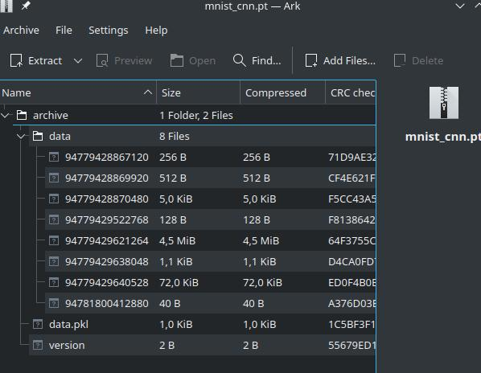

# Pytorch parse

This repository contains description how Pytorch model are saved and is attempt on understanding how to decode model parameters. Which can be used on custom hardware or embedded application where hardware and software optimization is required.

## Decoding .pt

When Pytorch model is saved (torch.save) new file is generated. New file has .pt
extension and contains all required parameters to load and run in separate
torch instance. Most common .pt is loaded in python as trained model, but it
can also run in libtorch which is C++ Pytorch library.

## How is model formatted

data.pkl can be viewed as text file. Inside are descriptions which connect weights and bias to corresponding data/* file.

